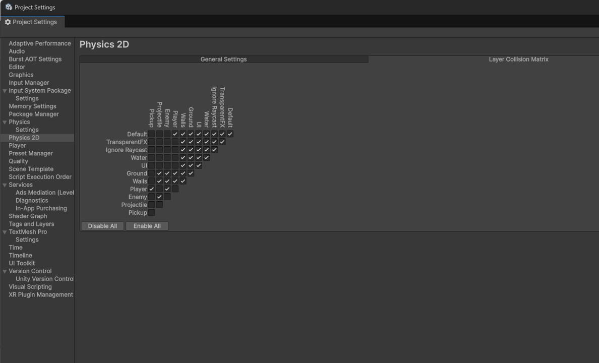
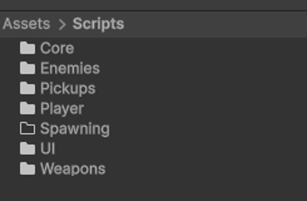
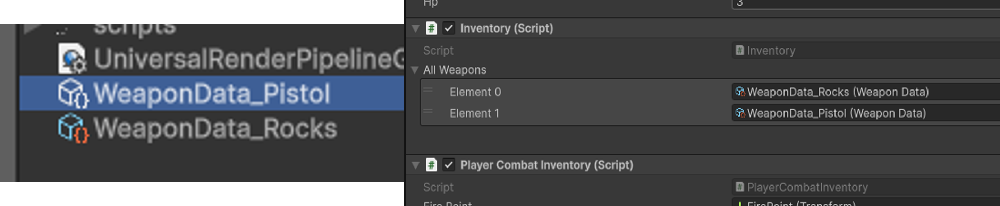

# IT'S SO SO OVER

# READ TS BEFORE YOU START

Hi guys good luck with ur deving lol

**Unity version must be 6000.3.0f1 or the whole thing will be cooked**

When you open the project you might see a bunch of warnings and stuff like that. My advice for that is pray and hope you select the right choices cus idk wtf is going on with that

Furthermore, you are cooked. The entire architecture was initially built on a system but I removed that system cus it didn't work for different features I was trying to implement soooooo there are left over remnants of that code, a lot of files are not in use and some are used in places where I don't even know if they should be.

The entire collision system is rigged with the unity physics 2d system so if stuff with collisions or collision triggers don't work it's probably that idek why it's rigged so weirdly

  

About the scenes, run the game from the Level1 scene, I tried building the level using unities system like yall wanted and you best believe I'm never doing ts again, we are going straight back to using 2d arrays from now on 💀💀

Uhh there are different enemy types that I didn't use, I had different ideas on what the variety of enemies would be so have fun trying to figure out what my vision was or just delete them and do what you want

Also the lobby I was gonna do but I felt like that takes away too much freedom from yall, delete the entire lobby or complete my vision, DO WHAT YOU WANT. I dont wanna restrict ym in any way or box one idea.

Also also the scripts aren't really commented so I'll explain here as much as I can.

  

Uuhh Core has the core scripts, lowkey I think some of these are redundant, I know that gamesession manages the coins and stuff that carries over from level to lobby. But gameManager sceneLoader??? Ion even remember making those icl. 

In the enemy folder, each enemy has their own code to operate. The enemybase code was meant to be underlying attributes that apply to all enemies but ts got COOKED and I just implemented it's main functions to each of the separate enemy files.

Pickups just has the gold coins pickup

Ummm player is cooked some of these scripts are redundant I don't think you need playerCombat anymore but I'm too scared to delete it. Inventory I think is meant to contain ALL weapons in the game and the combatInv manages weapons that the player has access to (I dont even know if the two weapons system actually works I just clocked I never tested it cus I didn't code buying weapons because I didnt code lobby whoopsie 🥹😹🫨)

Player controller is just movement. Lowkey I cooked ts and the whole movement is jank but I #believe in you

UI has UI stuff

I think the weapon scripts were coded pretty well, should be the easiest to understand

OH YEA

For each new weapon if you want to add any you need to add a weapon data file of that weapon like these

  

then add that file to the Inventory inside of player

I think that's all, if anything else is cooked LOL GL I believe in you, DMS was made to prepare you for these moments